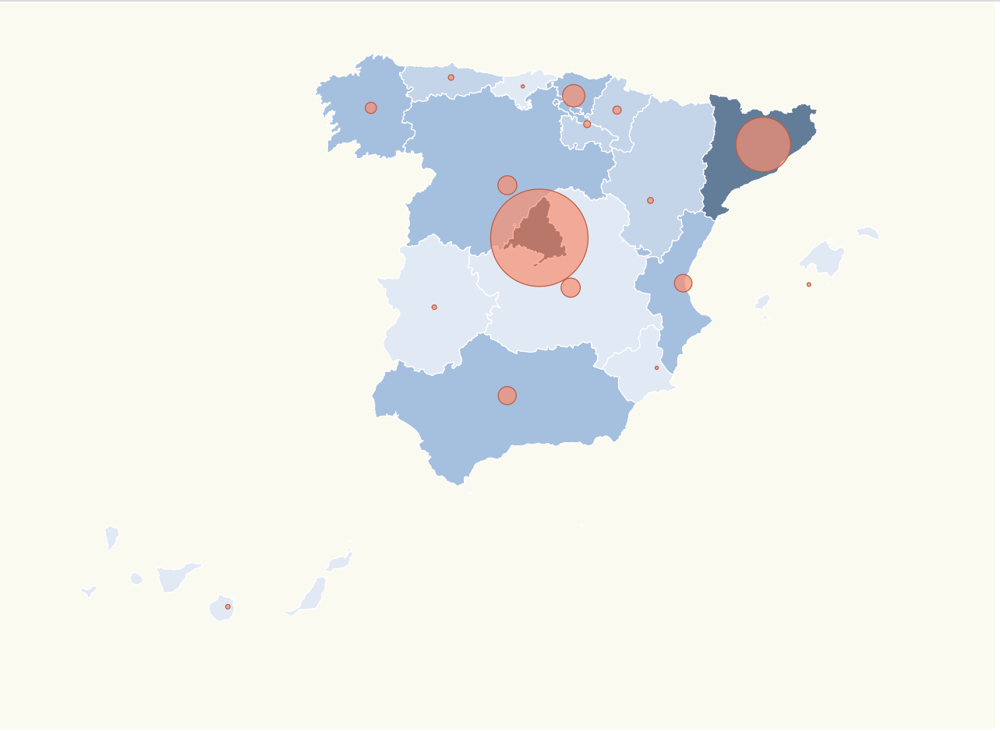

# Pinning locations Spain + Radius scale + Background Scale

Would you like to know how to make a map of Spain with a Radius Scale depending of the location affected cases and a background scale per community? Have you got a couple of available hours?
So let's get busy with this!!




# Steps

We will take as starting point our previous example: _data-visualization-mandatory_ let's copy the content from that folder and execute _npm install_.

```bash
npm install
```
This task has something new from the last task due to we have added a color scale for each community depending the affected cases.

First, there is a new function called _assignCCAABackgroundColor_ which takes two arguments, a _name_ from each community and a _ResultEntry_ and returns a color depending the affected cases.

_./src/index.ts_
```diff
+ assignCCAABackgroundColor = (comunidad: string,
+ data: ResultEntry[]) => {}
```
_maxAffected_ will return the max value infected cases of the entry array.
```diff
 assignCCAABackgroundColor = (comunidad: string,
 data: ResultEntry[]) => {
+  const maxAffected =
+  data.reduce(
+  (max, item) =>
+  (item.value > max ?
+  item.value : max),0);
}
```
Once we have our max value, we need to assign a color depending that value, our domain will be from 0 to the max value calculated between these values will be values multiplying 0.05, 0.1, 0.4, 0.5 and 0.6 for the max value, this will be our domain and the range will be each color. This scale was done with a _scaleThreshold_

_./src/index.ts_
```diff
assignCCAABackgroundColor = (comunidad: string, data: ResultEntry[]) => {
  const maxAffected =
  data.reduce(
    (max, item) => (item.value > max ? item.value : max),
    0);
  
+  const color =
+  d3
+  .scaleThreshold<
+  number, string>()
+  .domain([
+  0,
+  0.05*maxAffected,
+  0.1*maxAffected,
+  0.4*maxAffected,
+  0.5*maxAffected,
+  0.6*maxAffected,                +  maxAffected])
+  .range([
+    "#FFFFF",
+    "#E1E9F4",
+    "#C4D4E9",
+    "#A5BFDE",
+    "#839dbb",
+    "#637d99",
+    "#445e79",
+    "#25415A"
+  ]);
};
```
To end this function we define _entry_ that will be map with a value and a name, this variable will find the name taken as argument inside of the other argument _data_ and at the end the function will return the value that _color_ will assign for the value of infected cases inside of the variable.
```diff
assignCCAABackgroundColor = (comunidad: string, data: ResultEntry[]) => {
  const maxAffected =
  data.reduce(
    (max, item) => (item.value > max ? item.value : max),
    0);
  
  const color =
  d3
  .scaleThreshold<number, string>()
  .domain([0, 0.05*maxAffected, 0.1*maxAffected, 0.4*maxAffected, 0.5*maxAffected, 0.6*maxAffected, maxAffected])
  .range([
    "#FFFFF",
    "#E1E9F4",
    "#C4D4E9",
    "#A5BFDE",
    "#839dbb",
    "#637d99",
    "#445e79",
    "#25415A"
  ]);
  
+  const item = data.find(
+    item =>
+ item.name === comunidad);
+  return item ? color
+ (item.+value) : color(0);
};
```
Now that the scale of colors was created, we will add to the function called in the other example _updateRadius_ a variable called ccaa that will select all communities and each one will be filled with the appropiate color that _assignCCAABackgroundColor_ will assign it. The other part of the function will be exactly equal than _updateRadius_ in the other example, so this function was called _updateColorsAndRadius_ and will receive only an argument(_data_).

_./src/index.ts_
```diff
const updateColorsAndRadius = (data: ResultEntry[]) => {
+  const ccaa = svg
+ .selectAll("path");
+  ccaa
+    .merge(ccaa as any)
+    .transition()
+    .duration(500)
+    .attr("class", "country")
+    .style("fill",
+    function(d: any){
+      return assignCCAABackgroundColor(
+  d.properties.NAME_1,
+  data);
+    })

  const circles = svg
  .selectAll("circle");
    circles
      .data
      (latLongCommunities)
      .enter()
      .append("circle")
      .merge(
        circles as any)
      .transition()
      .duration(500)
      .attr(
        "class",
        "affected-marker")
      .attr("r",
      d =>               calculateRadiusBasedOnAffectedCases(d.name, data))
      .attr("cx",
      d =>
      aProjection(
        [d.long, d.lat])[0]
        )
      .attr("cy",
      d =>
      aProjection(
        [d.long, d.lat])[1]
        )
    };
```
Due to _updateRadius_ was renamed as _updateColorsAndRadiusupdateColors_ adding a variable which change the color of each community too, so let's make this modification in our code.

_./src/index.ts_
```diff
  document
  .getElementById("1March")
  .addEventListener("click", function handleInfected1March() {
-    updateRadius(stats1March);
+    updateColorsAndRadius(stats1March);
  });

  document
  .getElementById("23March")
  .addEventListener("click", function handleInfected23March() {
-    updateRadius(stats23March);
+    updateColorsAndRadius(stats23March);
  });
```
To complete our styling journey, let's modify our country css class with a different stroke and fill.

_./src/map.css_
```diff
.country {
  stroke-width: 1;
-  stroke: #2f4858;
+  stroke: #FFFF;
-  fill: #008c86;
+  fill: ##E1E9F4;
}

.affected-marker {
  stroke-width: 1;
  stroke: #bc5b40;
  fill: #f88f70;
  fill-opacity: 0.7;
}
}
```

Congratulations! The task ends here! Now if you want to look at the final result let's give a try!

```bash
npm start
```
